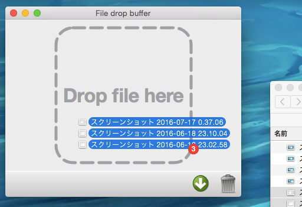
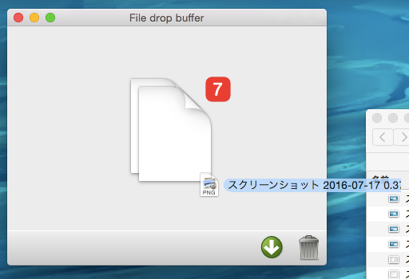

# File Drop Buffer

## これはなに？

通常は、ファイルのドラッグ ＆ ドロップは、一度しかできないですが、このソフトに溜め込むことで、複数の操作が一度にできるようになります。

例えば、

* ファイルをドロップして形式を変換するコンバータがあるとして、別々のフォルダにあるファイルを一度に変換できる。
* 複数のフォルダのファイルを一度に別のフォルダにコピーや移動できる。

など、です。

## インストール

ファイルを解凍するだけで実行できます。

解凍した中にできている `File Drop Buffer` というアプリケーションを実行してください。

## アンインストール

レジストリや設定ファイルなどは利用していないので、フォルダごと削除するだけです。

## 使い方

まず、ファイルをこのソフトの `Drop file here` と書かれている部分にドロップします。

何回かファイルをドロップし終えたら、アプリケーションの中央に表示されているファイルアイコンをドラッグし、目標とするアプリケーションへドロップします。

その他の機能は

* 右下のゴミ箱ボタンは、保持しているファイルの一覧をクリア
* その隣のボタンは、アプリケーションの最前面解除＆設定
また、PC以外では音が鳴らなかったり動作しなかったりする可能性があります。

## ライセンス

Copyright (c) 2016 sharkpp All rights reserved.

ソースコードは [MIT License](http://opensource.org/licenses/mit-license.php) の下でライセンスされます。

アイコンなどは [CC BY 4.0](http://creativecommons.org/licenses/by/4.0/) の下でライセンスされます。
